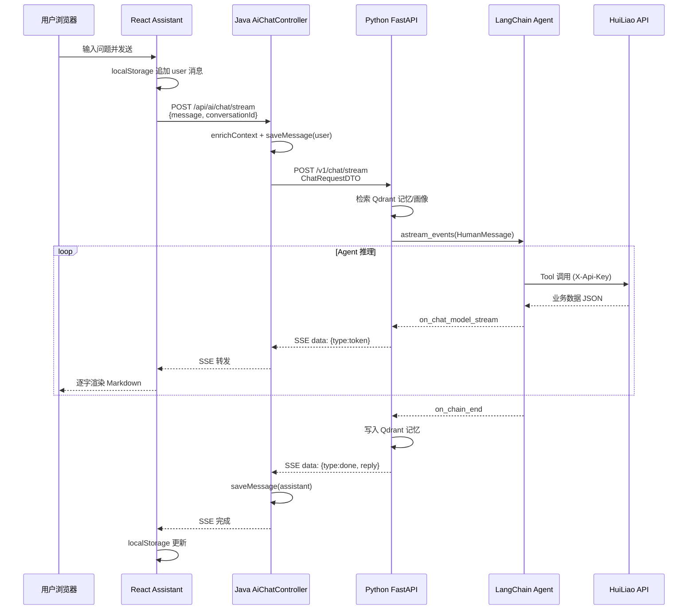

# HuiLiao AI 助手调用逻辑说明

> 本文档梳理 `huiliao-react/src/views/Assistant` 页面发起的 AI 对话，从前端 → Java 网关 → Python FastAPI Agent 的完整调用链路。

---

## 1. 架构总览

系统采用**三层代理**结构：前端不直接访问 Python AI 服务，而是经 Java Spring Boot 网关转发，由网关负责用户鉴权、上下文注入、消息持久化。

```
┌─────────────────────────────────────────────────────────────────────────┐
│  前端 (React)                                                            │
│  huiliao-react/src/views/Assistant/index.jsx                            │
│  huiliao-react/src/api/modules/ai.js                                    │
└───────────────────────────────┬─────────────────────────────────────────┘
                                │ POST /api/ai/chat/stream (SSE)
                                │ Authorization: Bearer <token>
                                │ Body: { message, conversationId }
                                ▼
┌─────────────────────────────────────────────────────────────────────────┐
│  Java 网关 (Spring Boot :8080)                                           │
│  AiChatController → AiChatService → AiServiceClient                     │
│  - 解析 Token，查库注入用户/患者上下文                                    │
│  - 注入内部 apiKey                                                       │
│  - 保存 chat_messages 到 MySQL                                           │
│  - 转发 SSE 流给前端                                                     │
└───────────────────────────────┬─────────────────────────────────────────┘
                                │ POST /v1/chat/stream (SSE)
                                │ Body: ChatRequestDTO（含 apiKey + 用户上下文）
                                ▼
┌─────────────────────────────────────────────────────────────────────────┐
│  Python AI 服务 (FastAPI :8000)                                          │
│  API/routers/chat.py → chains/qa.py                                     │
│  - LangChain ReAct Agent + HuiLiao Tools                                │
│  - Qdrant 会话记忆 / 用户画像                                            │
│  - 回调 Java API 查询业务数据 (X-Api-Key + X-User-Id)                    │
└─────────────────────────────────────────────────────────────────────────┘
```

**开发环境代理**：Vite 将 `/api` 代理到 `http://localhost:8080`（见 `huiliao-react/vite.config.js`）。

---

## 2. 前端层

### 2.1 页面入口

| 文件 | 职责 |
|------|------|
| `huiliao-react/src/views/Assistant/index.jsx` | AI 助手主页面（移动端 + PC 端双布局） |
| `huiliao-react/src/router/index.jsx` | 路由 `/assistant` |
| `huiliao-react/src/api/modules/ai.js` | 流式 / 非流式 API 封装 |

### 2.2 核心 Hook：`useChat()`

`useChat` 管理会话状态，逻辑如下：

1. **会话存储**：`localStorage` 键名 `huiliao_ai_sessions`，结构为 `[{ id, title, messages }]`
2. **发送消息**：调用 `chatStream({ message, conversationId })`
3. **流式渲染**：
   - `onToken(chunk)`：逐块追加到最后一条 `assistant` 消息
   - `onDone(reply)`：用完整回复覆盖（兜底）
4. **会话 ID**：默认 `default`；新建对话时生成 `session_${Date.now()}`

当前前端**仅使用流式接口** `/api/ai/chat/stream`；非流式 `chat()` 保留兼容但页面未调用。

### 2.3 API 封装：`chatStream()`

```javascript
// huiliao-react/src/api/modules/ai.js
POST /api/ai/chat/stream
Headers:
  Content-Type: application/json
  Accept: text/event-stream
  Authorization: Bearer <token>   // 有登录态时
  X-Token: <token>                // 同上，双写兼容
Body:
  { "message": "用户问题", "conversationId": "session_xxx" }
```

**SSE 解析规则**：

- 按 `\n\n` 切分事件块
- 取以 `data:` 开头的行，JSON 解析
- 事件类型：
  - `token` → 调用 `onToken(event.content)`
  - `done` → 调用 `onDone(event.reply || 已拼接全文)` 并结束
  - `error` → 抛出异常

### 2.4 UI 组件

| 组件 | 说明 |
|------|------|
| `ChatWelcome` | 空会话欢迎页 + 快捷提问建议 |
| `ChatMessage` | 用户纯文本 / 助手 Markdown（`react-markdown` + `remark-gfm`） |
| `TypingIndicator` | 等待首个 token 前的加载动画 |
| `AssistantMobile` / `AssistantPc` | 响应式布局，共享同一套 `useChat` 逻辑 |

---

## 3. Java 网关层

### 3.1 控制器：`AiChatController`

路径前缀：`/api/ai`

| 接口 | 方法 | 说明 |
|------|------|------|
| `/api/ai/chat` | POST | 非流式，返回 `Result<ChatResponseVO>` |
| `/api/ai/chat/stream` | POST | **主路径**，`produces: text/event-stream` |

**每次请求的处理顺序**（流式与非流式相同的前置步骤）：

1. `resolveToken()`：从 `Authorization: Bearer` 或 `X-Token` 取登录 Token
2. `enrichContext(dto, token)`：查库填充用户上下文（见 3.3）
3. `dto.setApiKey(aiServiceProperties.getApiKey())`：注入内部 API Key
4. `saveMessage(..., "user", dto.getMessage())`：用户消息写入 `chat_messages` 表
5. 调用 AI 服务，流式场景用 `CompletableFuture.runAsync` 异步推送 SSE
6. 收到 `done` 事件后 `saveMessage(..., "assistant", reply)` 持久化 AI 回复

### 3.2 服务客户端：`AiServiceClient`

| 方法 | 下游地址 | 超时 |
|------|----------|------|
| `chat()` | `POST {baseUrl}/v1/chat` | `read-timeout: 120s` |
| `streamChat()` | `POST {baseUrl}/v1/chat/stream` | `stream-read-timeout: 10m` |
| `isHealthy()` | `GET {baseUrl}/health` | 同普通客户端 |

流式客户端逐行读取 `data: {...}`，反序列化为 `ChatStreamEventVO`，通过 `ChatStreamConsumer` 回调给 Controller。

### 3.3 用户上下文注入：`enrichContext()`

从 Token 解析 `userId` 后查 `sys_user`，并据 `accountType` 补充：

| 字段 | 来源 | 用途 |
|------|------|------|
| `userId`, `username`, `realName` | `sys_user` | 身份标识 |
| `roleCode`, `portalType` | `sys_role` + `LoginAssembler` | 工具权限过滤 |
| `staffId` | `staff` 表（员工账号） | 医生门户 |
| `patientId`, `patientNo`, `patientName`, ... | `patient` 表（患者账号） | 患者门户 |

这些字段原样放入 `ChatRequestDTO`，转发给 Python 侧。

### 3.4 请求体：`ChatRequestDTO`

```java
{
  "message": "...",           // 必填
  "conversationId": "...",      // 前端会话 ID，用于 Qdrant 记忆
  "memoryEnabled": true,      // 可选，敏感场景可关闭记忆
  "apiKey": "...",            // Java 注入，不来自前端
  "userId": 12,
  "username": "...",
  "realName": "...",
  "roleCode": "patient",
  "portalType": "patient",
  "staffId": null,
  "patientId": 5,
  "patientNo": "...",
  ...
}
```

### 3.5 配置：`application.yml`

```yaml
ai:
  service:
    base-url: http://127.0.0.1:8000
    chat-path: /v1/chat
    chat-stream-path: /v1/chat/stream
    health-path: /health
    api-key: huiliao-ai-internal-key-2026
    connect-timeout: 5s
    read-timeout: 120s
    stream-read-timeout: 10m
```

---

## 4. Python AI 服务层

### 4.1 FastAPI 路由

| 文件 | 路由 | 说明 |
|------|------|------|
| `AILearn/ailearn_ai/API/routers/chat.py` | `POST /v1/chat` | 同步返回 `{ "reply": "..." }` |
| 同上 | `POST /v1/chat/stream` | SSE 流式 |
| `AILearn/ailearn_ai/API/app.py` | `GET /health` | 健康检查 `{ "status": "ok" }` |

请求体模型 `ChatRequest`（`API/schemas.py`）与 Java `ChatRequestDTO` 字段对齐，支持 camelCase 别名。

### 4.2 处理流程（以流式为例）

```
post_chat_stream(body)
  ├─ _resolve_api_key(body)          # body.apiKey 或 .env HUILIAO_API_KEY
  ├─ build_user_context_block(body)  # 生成 <current_user> XML 块
  └─ aiter_chat_events(...)          # chains/qa.py
       ├─ search_memories_weighted()     # Qdrant 会话记忆检索
       ├─ search_profile()               # 用户画像检索（有 userId 时）
       ├─ get_agent(portal_type, role_code)  # 按角色选工具集
       ├─ huiliao_api_context(api_key, user_id)  # ContextVar 绑定
       ├─ agent.astream_events(...)      # LangChain Agent 流式推理
       │    ├─ on_tool_start → SSE type=status
       │    ├─ on_chat_model_stream → SSE type=token
       │    └─ on_chain_end → 提取最终 messages
       ├─ add_memory_pair_with_dedup()   # 对话结束写入记忆
       └─ yield type=done, reply=完整回复
```

### 4.3 Agent 核心：`chains/qa.py`

- **LLM**：`ChatOpenAI`（模型来自 `.env` 的 `OPENAI_CHAT_MODEL`，默认 `gpt-4o-mini`）
- **Agent**：`langchain.agents.create_agent`（ReAct 模式）
- **系统提示**：`SYSTEM_PROMPT` 定义慧疗助手角色、工具使用原则、称呼规则
- **HumanMessage 注入顺序**：
  1. `<current_datetime>` 服务器时间
  2. 用户画像块（profile）
  3. 会话记忆块（memories）
  4. `<current_user>` 用户上下文
  5. `用户问题：{message}`

**Agent 缓存**：按 `(portal_type, role_code)` 组合键单例，不同角色加载不同工具集。

### 4.4 工具（Tools）与 Java 回调

工具定义在 `AILearn/ailearn_ai/tools/`，通过 `huiliao_client.api_request()` 回调 Java REST API。

**角色工具过滤**（`get_tools_for_role`）：

| 角色 | 可用工具 |
|------|----------|
| `patient` | 基础查询 + 患者档案 + 门诊自助（挂号/查处方/支付） |
| `doctor` / `admin` | 全部工具（含开方、接诊、发药等写操作） |
| 未指定 | 全量（CLI 兼容模式） |

**回调鉴权**（`auth_context.py` + `settings/base.py`）：

```
Agent 执行期间 ContextVar 存储 api_key / user_id
  → get_huiliao_auth_headers()
  → X-Api-Key: <内部密钥>
  → X-User-Id: <当前用户ID>
```

Java `AuthInterceptor` 识别 `X-Api-Key` 匹配 `ai.service.api-key` 时放行，并用 `X-User-Id` 设置 `UserContext`。

### 4.5 会话记忆

| 组件 | 路径 | 说明 |
|------|------|------|
| 向量库 | Qdrant（`QDRANT_URL`，默认 `localhost:6333`） | Collection `chat_memory` |
| 检索 | `memory/retriever.py` | 按 `conversationId` 过滤 + 语义检索 |
| 写入 | `memory/manager.py` | 带去重（相似度 ≥ 0.95 跳过）、TTL 90 天 |
| 画像 | `memory/profile.py` | 按 `userId` 跨会话用户画像 |

**触发条件**：`conversationId` 非空时启用；为空则退化为无记忆模式。

### 4.6 RAG 文档检索（独立模块）

`AILearn/ailearn_ai/rag/` 已实现完整 RAG 流水线（文档加载 → 分块 → 向量化 → Qdrant 索引 → 混合检索 → 重排 → 生成），**当前尚未接入 `chat.py` / `qa.py` 的对话主链路**。对话回答主要依赖 LLM 通用知识 + Tools 查业务数据 + Qdrant 会话记忆。

---

## 5. SSE 事件协议

三层之间统一的流式事件 JSON 格式：

| type | 字段 | 说明 |
|------|------|------|
| `status` | `content` | 状态提示，如「正在调用 list_registrations…」 |
| `token` | `content` | LLM 输出的文本片段 |
| `done` | `reply` | 完整回复（权威来源） |
| `error` | `content` | 错误信息 |

传输格式（每层一致）：

```
data: {"type":"token","content":"感冒"}

data: {"type":"done","reply":"感冒时应注意休息..."}

```

---

## 6. 鉴权与安全

```
┌──────────┐  Bearer Token   ┌──────────┐  apiKey in body   ┌──────────┐
│  浏览器   │ ──────────────► │  Java    │ ────────────────► │  Python  │
└──────────┘                 └──────────┘                   └──────────┘
                                   ▲                              │
                                   │  X-Api-Key + X-User-Id       │
                                   └──────────────────────────────┘
                                         Tools 回调 Java API
```

| 链路 | 鉴权方式 |
|------|----------|
| 前端 → Java | 用户登录 Token（`Authorization` / `X-Token`） |
| Java → Python | 无独立鉴权；`apiKey` 放在请求体，供 Python 回调 Java 使用 |
| Python → Java（Tools） | `X-Api-Key`（服务间密钥）+ `X-User-Id`（用户上下文） |

**Prompt 注入防护**：`user_context.py` 对用户输入字段做 XML 标签剥离、换行压缩、长度截断（单字段 ≤ 200 字符）。

---

## 7. 数据持久化

| 存储 | 表/位置 | 写入方 | 内容 |
|------|---------|--------|------|
| MySQL | `chat_messages` | Java `AiChatController` | 用户消息 + AI 回复（审计/回显） |
| localStorage | `huiliao_ai_sessions` | 前端 `useChat` | 会话列表与消息（仅浏览器本地） |
| Qdrant | `chat_memory` | Python `memory` 模块 | 会话语义记忆向量 |
| Qdrant | 用户画像 Collection | Python `memory/profile` | 跨会话用户画像 |

> 注意：前端 localStorage 与后端 `chat_messages` **未做同步**；页面刷新后展示的是本地缓存，后端库中有独立审计记录。

---

## 8. 时序图（流式对话）



---

## 9. 关键文件索引

### 前端

| 文件 | 说明 |
|------|------|
| `huiliao-react/src/views/Assistant/index.jsx` | 页面 + useChat Hook |
| `huiliao-react/src/api/modules/ai.js` | chatStream / chat API |
| `huiliao-react/vite.config.js` | `/api` → `:8080` 代理 |

### Java

| 文件 | 说明 |
|------|------|
| `HuiLiao/.../ai/controller/AiChatController.java` | REST 入口 + SSE 转发 |
| `HuiLiao/.../ai/client/AiServiceClient.java` | 调用 FastAPI |
| `HuiLiao/.../ai/dto/ChatRequestDTO.java` | 请求体 |
| `HuiLiao/.../ai/config/AiServiceProperties.java` | 配置属性 |
| `HuiLiao/.../config/AuthInterceptor.java` | Token / ApiKey 鉴权 |
| `HuiLiao/src/main/resources/application.yml` | AI 服务地址与密钥 |

### Python

| 文件 | 说明 |
|------|------|
| `AILearn/ailearn_ai/API/routers/chat.py` | `/v1/chat` 路由 |
| `AILearn/ailearn_ai/API/schemas.py` | ChatRequest / ChatResponse |
| `AILearn/ailearn_ai/API/user_context.py` | 用户上下文块构建 |
| `AILearn/ailearn_ai/chains/qa.py` | Agent 主逻辑 |
| `AILearn/ailearn_ai/tools/__init__.py` | 工具注册与角色过滤 |
| `AILearn/ailearn_ai/tools/huiliao_client.py` | 回调 Java HTTP 客户端 |
| `AILearn/ailearn_ai/auth_context.py` | 请求级 api_key / user_id |
| `AILearn/ailearn_ai/settings/base.py` | 环境变量与请求头 |
| `AILearn/ailearn_ai/memory/` | Qdrant 会话记忆 |
| `AILearn/ailearn_ai/rag/` | RAG 流水线（未接入对话） |

---

## 10. 本地启动与联调

| 服务 | 端口 | 启动方式 |
|------|------|----------|
| Java HuiLiao | 8080 | Spring Boot 主类 |
| Python ailearn-ai | 8000 | `python -m ailearn_ai.API` 或 uvicorn |
| React 前端 | 5173 | `npm run dev` |
| Qdrant（记忆） | 6333 | Docker / 本地安装 |
| MySQL | 3306 | 业务库 + chat_messages |

**环境变量（Python `.env` 常用项）**：

```env
OPENAI_API_KEY=...
OPENAI_BASE_URL=...          # 可选，兼容 DashScope 等
OPENAI_CHAT_MODEL=gpt-4o-mini
HUILIAO_API_BASE_URL=http://localhost:8080
HUILIAO_API_KEY=huiliao-ai-internal-key-2026   # 与 Java application.yml 一致
QDRANT_URL=http://localhost:6333
```

**联调检查清单**：

1. `GET http://localhost:8000/health` 返回 `{"status":"ok"}`
2. Java `ai.service.base-url` 指向 Python 服务
3. 两端 `api-key` / `HUILIAO_API_KEY` 一致
4. 前端已登录（Token 有效），否则 Java 不注入用户上下文但仍可对话
5. Qdrant 不可用时记忆功能降级，对话主流程不受影响

---

## 11. 扩展点

| 场景 | 建议改动位置 |
|------|--------------|
| 接入 RAG 文档问答 | 在 `qa.py` 的 `_build_human_message` 或 Agent 前增加 `run_rag_query()` |
| 新增业务 Tool | `AILearn/ailearn_ai/tools/` 对应子包 + `__init__.py` 注册 |
| 调整角色权限 | `get_tools_for_role()` 中的 `_GETTER_REGISTRY` / `_PATIENT_OUTPATIENT_GETTERS` |
| 前端恢复历史会话 | 新增 API 从 `chat_messages` 按 `conversationId` 拉取，替换纯 localStorage |
| 关闭某次对话记忆 | 前端传 `memoryEnabled: false`（DTO 已预留，Python 侧需对接） |

---

*文档生成时间：2026-06-18 · 基于当前 `实现RAG文档` 分支代码梳理*
