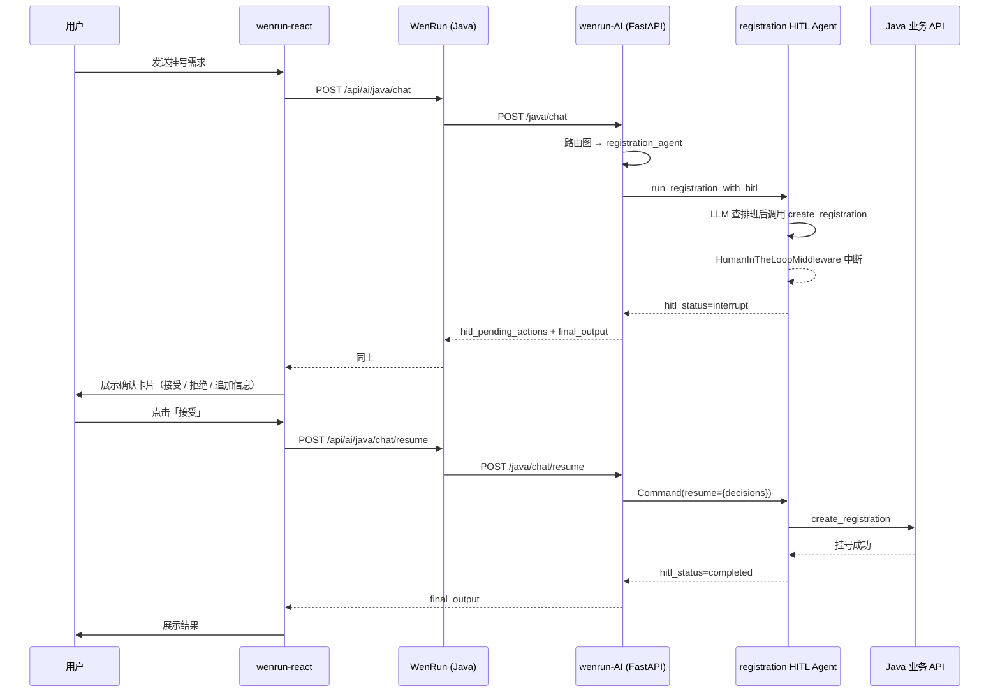

# HITL（Human-in-the-Loop）实现说明

本文档描述温润医院 AI 服务中 **写操作人工确认** 的完整实现，涵盖 Python Agent、FastAPI 接口、Java 网关与 React 前端。

---

## 1. 设计目标

对会修改业务数据的操作（挂号、支付等），在工具真正执行前强制中断，由患者在客户端明确授权后再继续。

| 原则 | 说明 |
|------|------|
| 一次确认 | 对话中展示摘要后，由确认卡片完成授权，不再口头追问「确认挂号吗？」 |
| 结构化决策 | 用户选择通过 `decisions` 传给 resume，不能把「确认」当普通聊天处理 |
| 会话绑定 | `session_id` 映射为 LangGraph `thread_id`，chat 与 resume 必须使用同一值 |
| 可扩展 | 在 `_HITL_INTERRUPT_ON` 中注册新工具即可纳入 HITL |

---

## 2. 端到端流程



### 典型用户路径（挂号）

1. 用户描述需求（如「挂内科明天下午的号」）
2. Agent 查询科室、排班，在对话中展示摘要
3. Agent 调用 `create_registration` → **中断**，前端弹出确认卡片
4. 用户点击 **接受** → 调用 resume → 挂号执行完成
5. 若用户点 **拒绝** 或 **追加信息**，以 `reject` 决策反馈给 Agent，由其调整或结束

---

## 3. 代码结构

```
wenrun-AI/
├── app/
│   ├── agents/
│   │   ├── hitl/
│   │   │   ├── __init__.py          # 模块导出
│   │   │   ├── common.py            # thread_id、中断解析、卡片文案 enrichment
│   │   │   └── registration.py      # HITL Agent 单例 + run / resume
│   │   └── router/
│   │       ├── nodes.py             # registration_agent 节点调用 HITL
│   │       └── prompts.py           # 挂号提示词（禁止口头二次确认）
│   ├── api/routes/
│   │   └── java_chat.py             # POST /java/chat 与 /java/chat/resume
│   └── schemas/
│       └── chat.py                  # JavaChatResumeRequest、HitlDecision
│
WenRun/（Java 网关）
├── ai/controller/AiChatController.java    # /api/ai/java/chat、/resume
├── ai/client/JavaAiClient.java
├── ai/vo/HitlPendingActionVO.java         # title / summary / details
└── ai/dto/HitlDecisionDTO.java
│
wenrun-react/
├── src/api/modules/ai.js                  # chat()、chatResume()
└── src/views/Assistant/
    ├── index.jsx                          # useChat、resolveHitl
    └── HitlChoiceBar.jsx                  # 接受 / 拒绝 / 追加信息
```

---

## 4. 核心组件

### 4.1 HumanInTheLoopMiddleware

位置：`app/agents/hitl/registration.py`

```python
_HITL_INTERRUPT_ON = {
    "create_registration": {
        "allowed_decisions": ["approve", "reject", "edit"],
        "description": "提交挂号",
    },
    "pay_charge": {
        "allowed_decisions": ["approve", "reject", "edit"],
        "description": "确认支付",
    },
}
```

- 使用 `create_agent` + `HumanInTheLoopMiddleware` + `InMemorySaver` checkpointer
- Agent 为**模块级单例**，checkpointer 必须在请求间复用，否则无法 resume
- 生产环境应将 `InMemorySaver` 替换为 Postgres 等持久化 checkpointer

### 4.2 thread_id 与 session_id

位置：`app/agents/hitl/common.py` → `resolve_hitl_thread_id`

| 输入 | thread_id |
|------|-----------|
| 有 `session_id` | 原样使用（推荐） |
| 仅有 `user_id` | `user-{user_id}`（不稳定，会打 warning） |
| 都没有 | `ephemeral-{uuid}`（无法 resume） |

前端 `conversationId`（如 `session_1782799448231`）经 Java 透传为 `session_id`，resume 时必须一致。

### 4.3 run 与 resume

| 函数 | 触发时机 | 调用方式 |
|------|----------|----------|
| `run_registration_with_hitl` | 用户发普通聊天 | `agent.invoke({messages: [...]}, config)` |
| `resume_registration_with_hitl` | 用户点击确认卡片 | `agent.invoke(Command(resume={"decisions": [...]}), config)` |

日志区分：

```
[HITL] run    | thread_id=... user_input='...'
[HITL] resume | thread_id=... decisions=[...]
```

若 resume 时日志仍显示 `run`，说明请求误走了 `/java/chat` 而非 `/java/chat/resume`。

### 4.4 结果格式化

`format_hitl_agent_result` 统一输出：

| 字段 | interrupt 时 | completed 时 |
|------|--------------|--------------|
| `hitl_status` | `"interrupt"` | `"completed"` |
| `hitl_thread_id` | thread_id | thread_id |
| `hitl_pending_actions` | 待确认列表（已 enrichment） | `null` |
| `final_output` | 简短提示文案 | Agent 最终回复 |

`enrich_pending_actions` 会调用 Java API 补全可读信息，例如挂号时请求 `GET /api/schedules/{id}`，生成：

```json
{
  "tool": "create_registration",
  "args": { "patient_id": "2", "schedule_id": "3" },
  "title": "挂号确认",
  "summary": "内科 · 张伟 · 2026-06-30 · 下午 · 10元",
  "details": [
    { "label": "科室", "value": "内科" },
    { "label": "医生", "value": "张伟" }
  ],
  "allowed_decisions": ["approve", "reject", "edit"]
}
```

---

## 5. API 契约

### 5.1 触发中断 — `POST /java/chat`

**请求**

```json
{
  "content": "挂内科明天下午的号",
  "session_id": "session_1782799448231",
  "user_id": "2"
}
```

**响应（中断）**

```json
{
  "intent": "registration",
  "target_agent": "registration_agent",
  "final_output": "请确认是否执行：**挂号确认** — 内科 · 张伟 · ...",
  "session_id": "session_1782799448231",
  "hitl_status": "interrupt",
  "hitl_thread_id": "session_1782799448231",
  "hitl_pending_actions": [ { "tool": "create_registration", "title": "挂号确认", ... } ]
}
```

### 5.2 恢复执行 — `POST /java/chat/resume`

**请求**

```json
{
  "session_id": "session_1782799448231",
  "user_id": "2",
  "decisions": [
    { "type": "approve" }
  ]
}
```

**决策类型**

| type | 含义 | 前端按钮 |
|------|------|----------|
| `approve` | 原样执行工具 | 接受 |
| `reject` | 拒绝执行，可带 `message` | 拒绝 / 追加信息 |
| `edit` | 修改 `edited_action` 后执行 | （预留，可扩展表单） |
| `respond` | 代替工具返回 | 当前未启用 |

**追加信息** 前端映射为：

```json
{ "type": "reject", "message": "用户补充说明：改挂后天的号" }
```

**响应（完成）**

```json
{
  "session_id": "session_1782799448231",
  "hitl_status": "completed",
  "hitl_pending_actions": null,
  "final_output": "挂号成功，挂号单 ID：4 ..."
}
```

若 resume 后仍有新的写操作，可能再次返回 `hitl_status=interrupt`。

### 5.3 Java 网关映射

| 前端 | Java | Python |
|------|------|--------|
| `POST /api/ai/java/chat` | `AiChatController.javaChat` | `POST /java/chat` |
| `POST /api/ai/java/chat/resume` | `AiChatController.javaChatResume` | `POST /java/chat/resume` |

Java 自动注入 `access_token` 到 `extra`，供 Python 调用业务 API。

---

## 6. 前端确认卡片

组件：`wenrun-react/src/views/Assistant/HitlChoiceBar.jsx`

- 当 `hitl_status === 'interrupt'` 且未 `resolved` 时渲染
- **隐藏**重复的气泡文案，仅展示卡片（标题、摘要、详情表、三个按钮）
- `resolveHitl` 调用 `chatResume`，不再把「确认」当普通 `chat` 发送

```javascript
// 接受
decisions: [{ type: 'approve' }]

// 拒绝
decisions: [{ type: 'reject', message: '用户拒绝执行该操作' }]

// 追加信息
decisions: [{ type: 'reject', message: '用户补充说明：...' }]
```

`decisions` 数量须与 `hitl_pending_actions` 一致（按顺序一一对应）。

---

## 7. 路由图集成

`registration_agent` 节点（`app/agents/router/nodes.py`）是唯一接入 HITL 的 Agent 节点：

```
retrieve_memory → analyze_intent → registration_agent → store_memory → END
```

`RouterState` 携带 `hitl_status`、`hitl_thread_id`、`hitl_pending_actions`，由 `java_chat._serialize_router_result` 序列化返回。

---

## 8. 扩展指南

### 8.1 新增需 HITL 的工具

1. 在 `registration.py` 的 `_HITL_INTERRUPT_ON` 注册工具名与 `allowed_decisions`
2. 在 `common.py` 的 `_TOOL_TITLES` 与 `enrich_pending_action` 中补充展示逻辑
3. 确认 Java `HitlPendingActionVO` 能透传 `title` / `summary` / `details`

### 8.2 新增独立 HITL Agent

若某意图需要单独的 Agent（非挂号），可复制 `registration.py` 模式：

- 独立 `create_agent` + middleware + checkpointer 单例
- 提供 `run_*_with_hitl` / `resume_*_with_hitl`
- 在对应路由节点或专用 resume 接口中调用

### 8.3 生产部署注意

| 项 | 开发环境 | 生产建议 |
|----|----------|----------|
| Checkpointer | `InMemorySaver` | Postgres / Redis 等持久化 |
| 多实例 | 单进程可用 | 必须共享 checkpointer 存储 |
| session_id | 前端 localStorage | 保证同一会话 ID 稳定 |

---

## 9. 常见问题

### Q: 用户打字「确认」后一直循环中断？

**原因**：请求走了 `POST /java/chat`，被当作新消息 `run`，而非 `resume`。

**解决**：使用确认卡片调用 `/java/chat/resume`，或确保前端 `resolveHitl` 已接入。

### Q: resume 报 thread 找不到或状态丢失？

**原因**：`session_id` 与首次 chat 不一致，或服务重启后 `InMemorySaver` 清空。

**解决**：新建对话重试；生产换持久化 checkpointer。

### Q: 卡片上没有科室/医生名称？

**原因**：`GET /api/schedules/{id}` 未返回 `deptName` / `staffName`。

**解决**：Java 端 `ScheduleController.get` 应返回 `ScheduleVO`（含关联名称）。

### Q: 为什么要 HITL，提示词里不让 Agent 口头确认不够吗？

口头确认无法阻止 LLM 误调工具；HITL 在**工具执行前**硬中断，患者必须显式授权，满足医疗写操作的安全要求。

---

## 10. 相关文件速查

| 文件 | 职责 |
|------|------|
| `app/agents/hitl/registration.py` | HITL Agent、中断策略、run/resume |
| `app/agents/hitl/common.py` | thread_id、解析中断、enrichment、格式化 |
| `app/api/routes/java_chat.py` | HTTP 入口 |
| `app/schemas/chat.py` | Resume 请求与 Decision 模型 |
| `app/agents/router/prompts.py` | 禁止口头二次确认 |
| `WenRun/.../AiChatController.java` | Java 网关 |
| `wenrun-react/.../HitlChoiceBar.jsx` | 确认卡片 UI |
